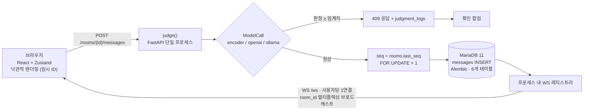

# Career-Jikimi — 사내 채팅 메시지 오발송 방지 AI 가드

<table align="center">
<thead><tr><th>항목</th><th>내용</th></tr></thead>
<tbody>
<tr><td><b>기간</b></td><td>2026-07-29 → 2026-08-04 (6일)</td></tr>
<tr><td><b>팀 구성</b></td><td>2명 (기존 6명에서 축소)</td></tr>
<tr><td><b>역할</b></td><td>AI / 풀스택 — 데이터셋 설계, 미세조정, 평가, 판정 파이프라인, 데모 채팅 앱 개발</td></tr>
<tr><td><b>모델/데이터</b></td><td>HF Hub <code>agii0114/career-jikimi-context-guard</code>, <code>agii0114/career-jikimi-context-dataset</code></td></tr>
</tbody>
</table>

### 주제 (Topic)

* 한국어 사내 업무용 채팅을 위한 **전송 전 메시지 오발송 감지기**입니다. 사용자가 전송 버튼을 누르면, 해당 채팅방의 최근 대화 내역과 입력한 메시지가 미세조정된 한국어 Cross-Encoder 모델로 전달되어 "이 채팅방에 어울리지 않을 확률"을 반환합니다.

* 확률이 임계치를 넘으면 메시지가 저장·전송되기 전 확인 팝업창을 띄웁니다. 데이터 누수가 통제된 데이터셋, 미세조정 분류기, 평가 프로토콜, 교체 가능한 판정 백엔드 등 **판정 능력 그 자체**가 핵심 성과물이며, 실시간 채팅 앱은 기능 시연을 위해 가볍게 구현되었습니다.

### 기획 의도 (Planning Intent)

* 한 번 읽힌 잘못 보낸 메시지는 회수할 수 없으므로 전송 단계에서 미리 차단하도록 설계했습니다. 개발 직전 팀원이 6명에서 2명으로 줄어듦에 따라, 기존 VLM/이미지 감지 범위를 축소하고 "텍스트 기반의 맥락 중심 오발송 감지"로 문제를 재정의하여 6일 안에 완성할 수 있도록 조정했습니다. 정상적인 메시지에 팝업이 뜨면 서비스 사용성이 크게 저하되므로, 정밀도(Precision) 최우선 정책(오탐 0건)을 최우선 목표로 최적화했습니다.

* 실제 운영 중에는 차단된 메시지만 피드백이 들어오므로 재현율(Recall)은 측정이 불가능한 것으로 명시하고 오발송 신고 버튼을 별도 제공했습니다. 욕설/개인정보 필터링은 범위에서 제외하여 오직 오발송 감지 성능만 정밀 측정하도록 유지했습니다.

### 아키텍처 (Architecture)

### 주요 작업 및 성과 (Key Work & Outcomes)

| 항목 | 내용 |
|---|---|
| **데이터셋 엔지니어링 (6일 중 3일 소요)** | TF-IDF 검증 시 대화 맥락 없이 답변만 보고도 99.2% 정확도가 나오는 현상을 확인하고 v1 데이터셋을 폐기(말투 분류기가 되는 문제). 동일 답변이 적절/부적절 맥락에 각각 1회씩 교차 등장하는 **1,000건의 반실제적 쌍(Counterfactual-pair) 데이터셋**으로 재구축(답변만 보고 맞추는 수치 0.40으로 정상화). 16개 가상 대화방 및 200건의 테스트 세트 작성. |
| **화자 익명화** | 학습 데이터의 화자 표기를 서빙 형식과 동일하게 가공(`팀장:` → `A:`)하여 모델의 일반화 성능 향상 (검증 정확도 0.855 → 0.890). |
| **모델 미세조정** | `skt/A.X-Encoder-base` (ModernBERT, 149M) 모델을 이진 Cross-Encoder로 미세조정. 쌍(Pair) 단위 StratifiedGroupKFold 5-fold 교차 검증 적용 및 4 에포크(Epoch) 학습 고정. |
| **평가 결과** | 평가 데이터셋 기준 **AUC 1.000, Precision 1.000, 오탐(False Positive) 0건** 달성, CPU 환경 평균 응답 속도(p50) 512ms 기록. 대화 내역을 타 대화방 내용으로 교체하는 절제 연구(Ablation) 시 AUC가 0.638로 하락하여 맥락 의존성 입증. OOF 정확도 0.854로 규칙 기반 Baseline(0.725) 대비 우수. |
| **판정 백엔드 & 데모 앱** | 3가지 판정 백엔드 연동, CLI 기반 오프라인 평가 도구 제공, FastAPI + MariaDB + React 데모 앱 구축, 8개 ADR 작성, pytest 355개 / Vitest 147개 테스트 통과, CPU 전용 PyTorch 활용 3단계 Docker 빌드 적용. |

### 기술 스택 (Tech Stack)

| 분류 | 기술 |
|---|---|
| **ML** | PyTorch, transformers, skt/A.X-Encoder-base, scikit-learn (StratifiedGroupKFold, TF-IDF leakage probes), pandas, Hugging Face Hub, Colab T4 / RTX 3050; OpenAI Structured Outputs, Ollama (qwen3.5:4b) |
| **Backend** | Python 3.12, FastAPI 0.115, SQLAlchemy 2.0 (async), Alembic, MariaDB 11, Starlette WebSocket, PyJWT, argon2-cffi, pydantic-settings |
| **Frontend** | React 18, TypeScript 5.7, Zustand 5, Vite 6, Vitest |
| **Infra / QA** | Docker, Docker Compose, nginx, multi-stage Dockerfile, pytest, ruff, pip-audit, AI-DLC 워크플로우 |

### 트러블슈팅 (Troubleshooting)

- **배포 환경 임계치(Threshold) 0.99 오적용 문제** 
  설정 파일 우선순위에 의해 학습 시 생성된 `threshold.json`의 0.99 값이 적용되어 감지 알림이 거의 뜨지 않던 오류 발견. 환경 변수(env) 값을 최우선 적용하도록 수정하고 서버 시작 시 적용된 설정을 로그로 출력하도록 개선.

- **학습 전 데이터셋 누수(Leakage) 현상** 
  답변만으로 99.2% 정확도가 나와 정답 라벨이 '맥락'이 아닌 '말투'에 매겨져 있음을 발견. 반실제적(Counterfactual) 데이터 쌍 재구축, GroupKFold 교차 검증 적용 및 상시 누수 검증 로직을 프로젝트 규칙으로 정의.

- **특정 이름 사용으로 인한 모델 암기 현상** 
  대화 내역에 특정 한국어 이름이 반복 등장하여 오버피팅 발생. 등장 순서대로 화자를 `A/B/C`로 익명화하여 서빙 형식과 일치시키고 검증 정확도를 0.855에서 0.890으로 개선.

- **절대적 기준으로 인한 학습 게이트 패일 오류** 
  학습 노트북에서 요구하는 "학습 정확도 ≥ 0.90" 기준 때문에 정상 학습 결과(train 0.885 / val 0.890)가 실패로 출력되던 문제를 상대적 검증 기준(`train < max(0.70, val − 0.02)`)으로 교체하여 해결.

- **난이도 높은 평가 데이터셋에서 재현율(Recall) 0.020 기록** 
  오답 50건 분석 결과 92%가 지시 위반이나 단순 사실 관계 모순 때문임을 확인. 모델 한계를 문서화하고 2단계 개선 계획(규칙 기반 사전 검사 + 모순 유형 추가 데이터 학습) 수립.

